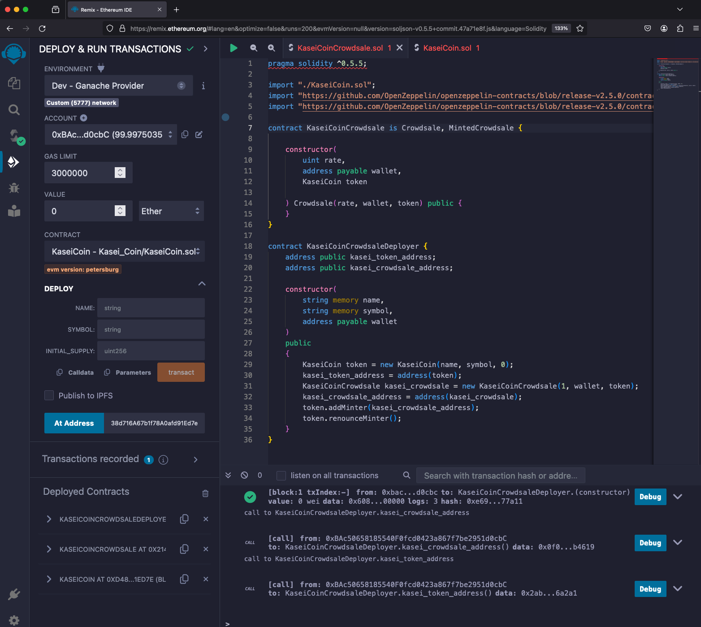
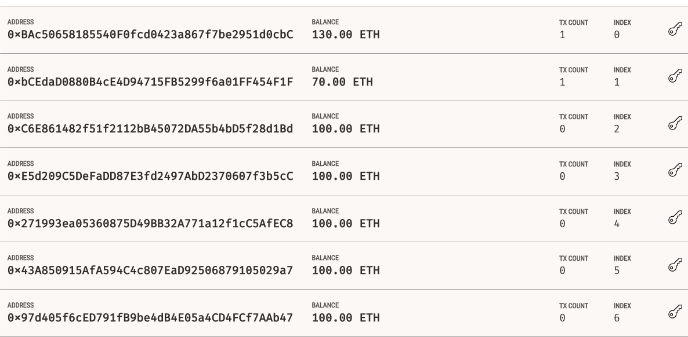
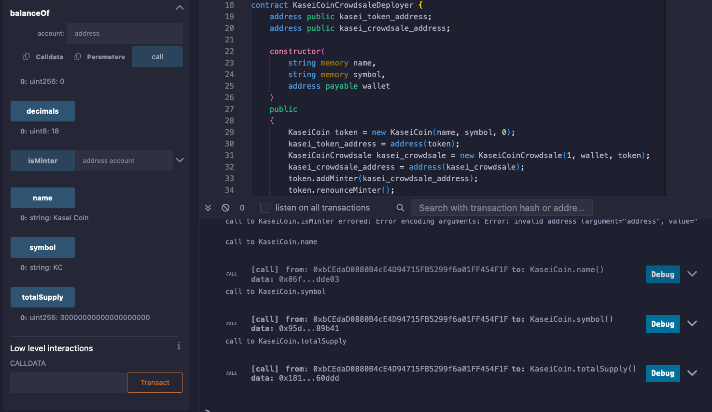
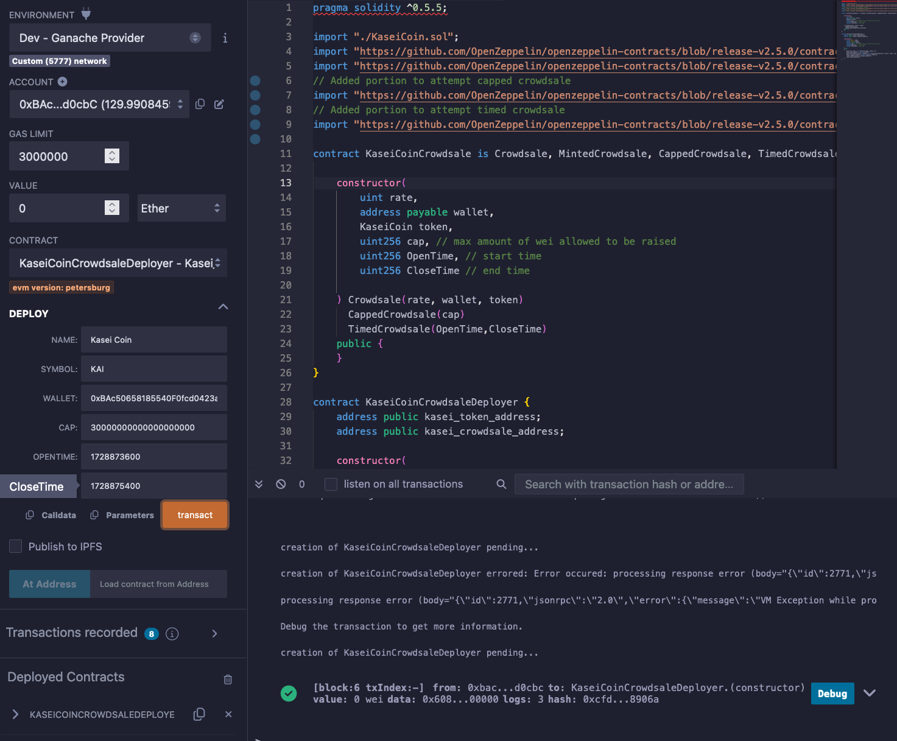
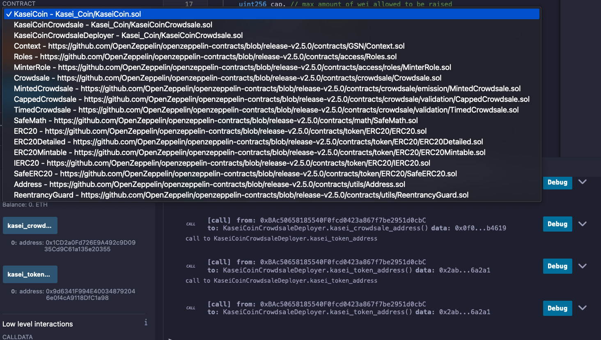
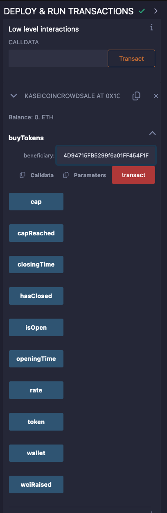

# Unit 21: Martian Token Crowdsale

## Background

After waiting for years and passing several tests, the Martian Aerospace Agency selected you to become part of the first human colony on Mars. As a prominent fintech professional, they chose you to lead a project developing a monetary system for the new Mars colony. You decided to base this new system on blockchain technology and to define a new cryptocurrency named **KaseiCoin**. (Kasei means Mars in Japanese.)

KaseiCoin will be a fungible token that’s ERC-20 compliant. You’ll launch a crowdsale that will allow people who are moving to Mars to convert their earthling money to KaseiCoin.

## Deployed Contracts

Contracts have been deployed as can be seen in the screen shot below.

Wallet 1 has been assigned as the owner/beneficiary of the Kasei Coin Crowdsale.

Wallet 2 has purchased 30 ETH worth of Kasei Coin (KC)

Proof of transaction can be seen below.

We have further identified the balance of the crowdsale to the latest instance.

Deployed contracts were confirmed to function properly. Steps to deploy and purchase as follows.

1. Compile .sol file.
2. Select the "deploy" icon.

3. Select the environment in which you choose to test your contracts. Remix now has built in environments, and direct to Ganache connectivity so MetaMask is not required.
4. Select a wallet to be the beneficiary of the funds of the crowdsale.
5. Select the KaseiCoinDeployer Contract and fill in the appropriate information. In the latest case, we have max wei to be raised, and start time and end time. Note: the time has to be in Unix timestamp. Example seen below.

6. At this point the CrowdSale address needs to be assigned the KaseiCoinCrowdsale Contract and the Token address assigned to the KaseiCoin Address.

7. Purchase KaseiCoin by selecting a secondary wallet. Assigning a "Value" as to the number of Ether, Wei, Gwei, or Finney that would like to be purchased. Copying the new address and purchase tokens as previously done.

